# Clasificador de Anime: Dragon Ball vs Attack on Titan
- Andres David Guevara Martinez 230231022
- Nicolas Gutirrez Escudero 230231029
- Sebastian Morales Flores 230231002
- Jhon Edward Steven loaiza diaz 230231046
Este proyecto implementa un modelo de Machine Learning para clasificar imagenes en dos categorias:

- Dragon Ball
- Attack on Titan

El objetivo es recibir una imagen y predecir a que anime pertenece.

## Origen del dataset

El dataset fue armado a partir de imagenes extraidas de Google y organizadas para entrenamiento y pruebas.

## Ajustes realizados sobre el flujo original (Colab)

Durante la adaptacion del notebook original de Colab al proyecto local se aplicaron mejoras clave:

### 1. Mejora en `extraer_hist`

Se adapto `extraer_hist` para reconocer una mayor gama de colores, mejorando la representacion visual de las imagenes y la calidad de los datos de entrada para el modelo.

### 2. Cambios en `procesar`

Se hicieron ligeros ajustes para procesar correctamente los datos que estaban en la carpeta de entrenamiento de Colab.

Problema detectado:

- Al crear carpetas y subir imagenes en Colab, se generaba automaticamente `.ipynb_checkpoints`.
- Esa carpeta introducia una ruta adicional inesperada.
- Como resultado, fallaba la lectura de imagenes.

Solucion aplicada:

- Se incorporo `valid_extensions` para filtrar archivos validos y evitar rutas/archivos no deseados.

Evidencia del flujo original en Colab (antes de los ajustes):

| Version adaptada | Version original (profesor) |
|---|---|
| 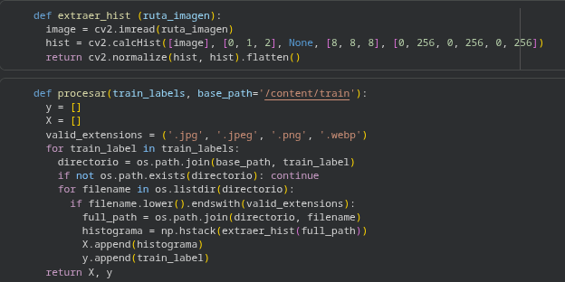 | 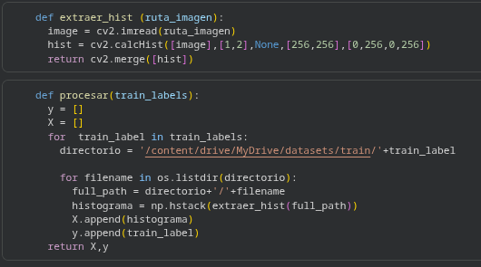 |

### 3. Ajuste del modulo de pruebas

Se modifico el modulo de pruebas del archivo original de Colab para utilizar un `for` y predecir la categoria de multiples imagenes de manera automatizada.

Evidencia del ajuste en pruebas:

| Version adaptada | Version original (profesor) |
|---|---|
| 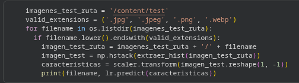 | 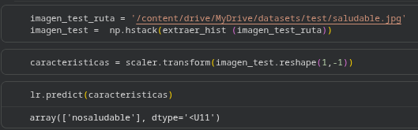 |

### 4. Integracion de API

Despues de validar las pruebas:

- Se declararon las funciones necesarias para exponer endpoints.
- Se implementaron los endpoints con FastAPI.
- Se expusieron de forma publica con ngrok.
- Se validaron las peticiones y respuestas con Postman.

## Flujo general del proyecto

1. Recoleccion de imagenes (Google).
2. Extraccion de caracteristicas de color (`extraer_hist`).
3. Procesamiento robusto de rutas y extensiones (`procesar` + `valid_extensions`).
4. Entrenamiento y pruebas del clasificador.
5. Exposicion del modelo por API (FastAPI + ngrok).
6. Pruebas de consumo con Postman.

## Capturas del proceso

### Capturas principales

| Flujo en Colab | Flujo en Colab |
|---|---|
| **Cap 1. Ajustes en `extraer_hist` y `procesar`** 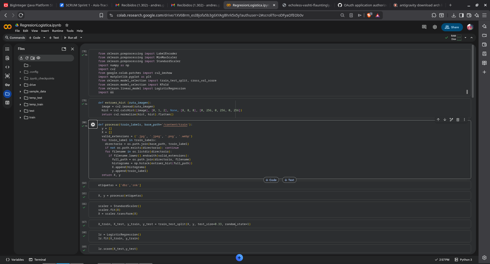 | **Cap 2. Pruebas por lote y funciones para API** 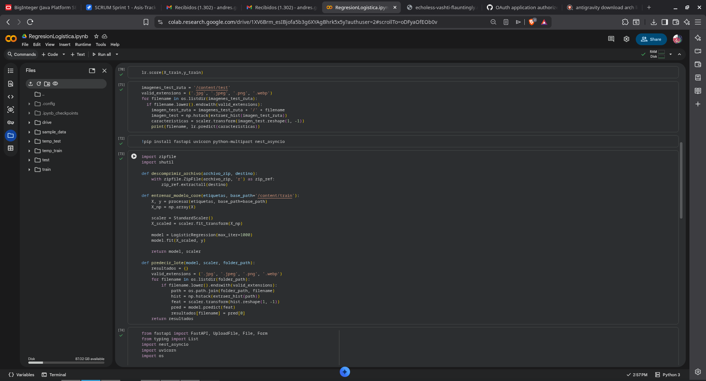 |
| **Cap 3. Implementacion de endpoints en FastAPI** 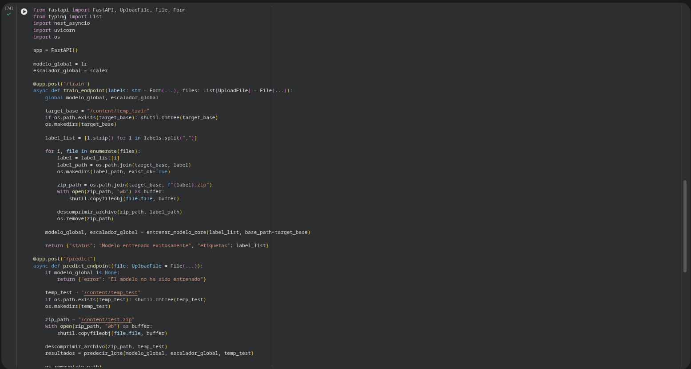 | **Cap 4. Configuracion de ngrok y arranque del servidor** 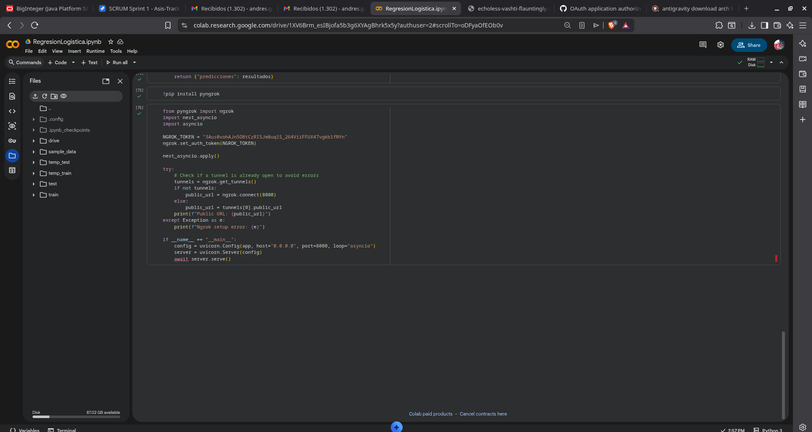 |
| **Cap 5. Servidor ejecutandose con URL publica ngrok** 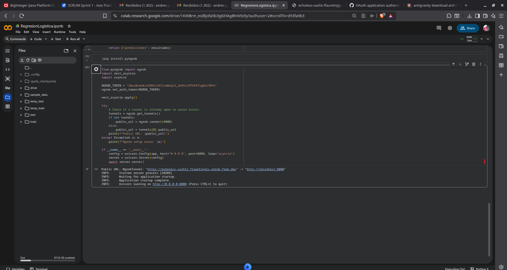 | **Cap 6. Prueba del endpoint `/train` en Postman** 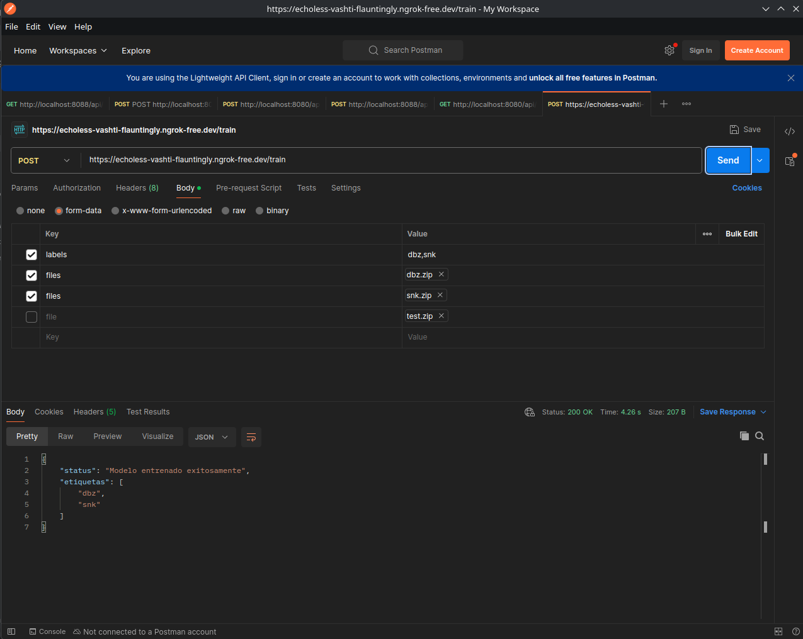 |

**Cap 7. Prueba del endpoint `/predict` con predicciones por archivo**

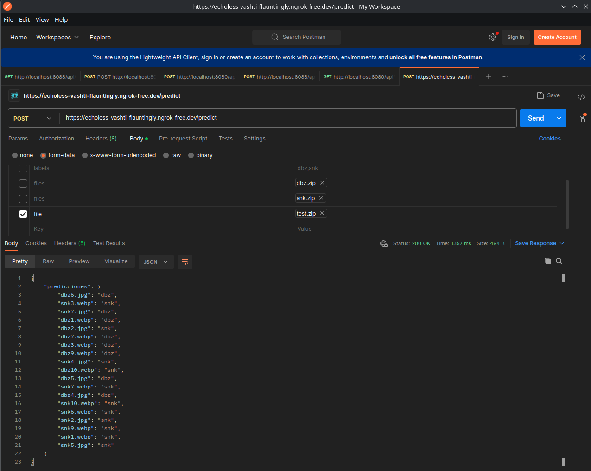

## Estado

Proyecto funcional para clasificacion binaria de imagenes con despliegue de endpoints para inferencia.

